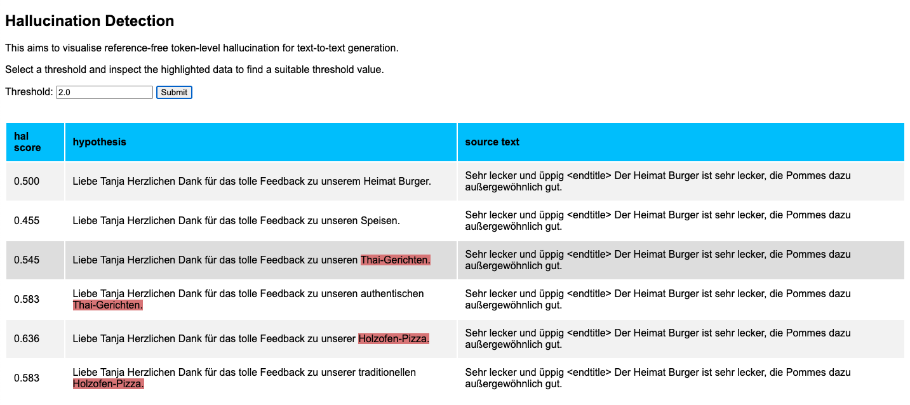

This repo contains LM-based methods for hallucination detection in
conditioned text generation.

## PPL(T|S) vs. PPL(T)

Given a trained conditional LM that is trained on src-tgt
pairs, we use it to score a target sequence in two ways:
- conditioned on the source
- unconditioned

To score src-tgt pairs, use `hallu_lm.py`, e.g.

```
python hallu_lm.py \
--dict /srv/scratch6/kew/lm_data/rrgen_de/prep_data_cond \
--lm /srv/scratch6/kew/lm_data/rrgen_de/gpt2small/210628/checkpoint_best.pt \
--infile /srv/scratch6/kew/lm_data/rrgen_de/validation_src_tgt_for_hallucination_detection_de.txt \
--outfile /srv/scratch6/kew/lm_data/rrgen_de/validation_src_tgt_hallucination_detection_de_wl.jsonl \
--gpu
```

where `--infile` is expected to contain one src-tgt pair
separated by `\<BOS\>` per line, e.g.

```
Immer wieder ein Prosecco Halt wert.... <BOS> Vielen Dank, dass Sie regelmässig bei uns im Ristorante Waisenhaus zu Gast sind und sich die Zeit für ein Feedback genommen haben. Es freut uns zu hören, dass Ihnen unser Prosecco so gut schmeckt. Wir hoffen entsprechend Sie schon bald wieder bei uns begrüssen zu dürfen, zum Beispiel auch einmal zum unkomplizierten Lunch.
Richtig lecker <BOS> Vielen Dank für Ihren Besuch bei uns in Seewen und für Ihre Bewertung mit der Bestnote. Wir wissen beides sehr zu schätzen und hoffen Sie schon ganz bald wieder bei uns zu begrüssen, zum Beispiel auf einen McRaclette (nur für kurze Zeit).
```

**NOTE**: Removal of the source for scoring PPL(T) is done internally.

## Visualisation

Once sequences have been scored using the LM, we can
generate a static html file to assist with visualising the
results.

To generate html, use
`generate_static_html_for_visualisation.py`, e.g.

```
python generate_static_html_for_visualisation.py /srv/scratch6/kew/lm_data/rrgen_de/validation_src_tgt_hallucination_detection_de_wl.jsonl > /srv/scratch6/kew/lm_data/rrgen_de/validation_src_tgt_hallucination_detection_de_wl.html
```

Open the output html file in a browser. Expected output is
something like:




## LMcond vs LMunc (Filippova (2020))

The idea was proposed by Filippova (2020) "Controlled
Hallucinations: Learning to Generate Faithfully from Noisy
Data".

The basic idea:
- Train two language models LM_{cond} and LM_{unc} to predict the target
texts. 
  - LM_{unc} is an unconditional LM trained only on the targets.
  - LM_{cond} is a conditional LM trained on source-target pairs.
- use LM_{cond} to get score PPL(T|S)
- use LM_{unc} to get score PPL(T)
- **ISSUE**: it is difficult to control for differences in PPL scores
  that are the result of training two separate LMs, not the
  influence of the source text (Fernandes et al. (2021)
  propose similar scoring techniques using a SINGLE translation model).

## Data prep and LM training
- use `train_spm.py` to learn a SentencePiece model on the data
- use `apply_spm.py` to tokenize data with the SentencePiece
  model
- `train_lmcond.sh` can be used to train the LM


## Environment Setup

To set up the virtual environment, run

```
cd scripts
bash setup_env
conda activate <name-of-new-env>
```

Fairseq commands are taken from
https://github.com/pytorch/fairseq/tree/master/examples/language_model


## Minimal example

```
# score PPL(T|S) and PPL(T) for dummy examples
python hallu_lm.py \
--dict /srv/scratch6/kew/lm_data/rrgen_de/prep_data_cond \
--lm /srv/scratch6/kew/lm_data/rrgen_de/gpt2small/210628/checkpoint_best.pt >| data_egs/scores.jsonl

# generate static html for visualising
python generate_static_html_for_visualisation.py data_egs/scores.jsonl >| data_egs/scores.html
```

## Known 🐛 / 🧚

- sequence lengths > model's max sequence length (e.g. 768
  for gpt2small model) are skipped when performing scoring.
  Truncation needs to be implemented.
- scoring works as expected for small dummy set of examples,
  but when scoring full validation set, scoring is bad


